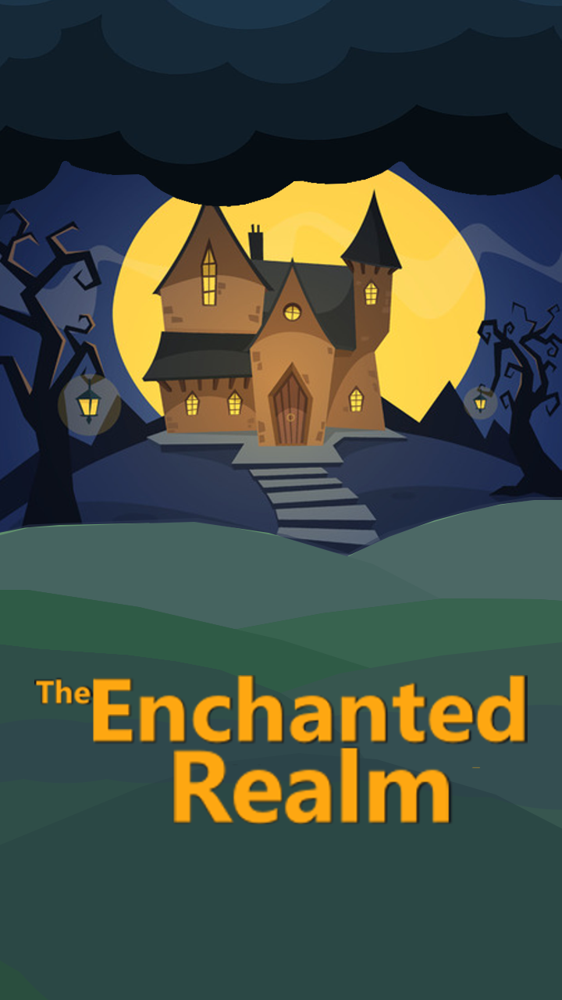

## 👋 Hi, I’m @The1WaterBottle (Patrik)
- 👀 I’m interested in WebDev, AI/ML and video game dev using C++ and OpenGL  (at the moment) 
- 🌱 I’m currently learning C++ and python

<h2> Languages  </h2> 

 

<h2> Tools  </h2> 

 

<h2> Current Projects  </h2>

   
<strong>The Enchated Realm</strong>

   This is my main project a game called 'The Enchanted Realm'   This game was made using C++ and the raylib library (https://www.raylib.com/)  
   Features : 1-2 player (splitscreen/online)  
   game versiov : 0.0.1-230720-alpha raylib versiob : 4.0  

<!---
The1WaterBottle/The1WaterBottle is a ✨ special ✨ repository because its `README.md` (this file) appears on your GitHub profile.
You can click the Preview link to take a look at your changes.
--->
